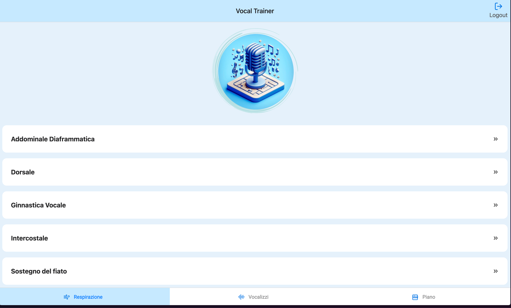
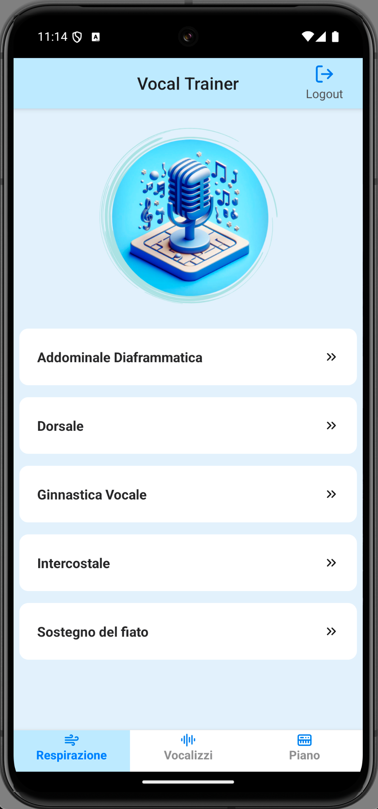

# Vocal Trainer 
</br>
<p align="center">
  
</p>

### Welcome to the Vocal Trainer app, a cross-platform vocal training app developed using React Native with Expo.

## Demo
### If you are curious to try it out, you can check the [Web Demo](https://vocaltrainer.netlify.app/)

<p align="center">
  
  
</p>

## Description

The Vocal Trainer app is a mobile application designed to help singers improve their vocal skills through targeted exercises. The app offers several exercise sections:

- Breathing Exercises
- Vocal Exercises

Each section provides a series of exercises specifically created to develop and improve specific singing skills.

### **Currently, only practice audio suitable for tenor voices is available in the vocal exercises section.**

## Main Features

- Breathing Exercises: This section offers a series of exercises designed to improve breath control and lung capacity for singers.
<!-- 
- Rhythmic Exercises: Here you will find exercises to refine your sense of rhythm and precision in interpreting musical notes. (Still in the planning stage) -->

- Audio Exercises with Vocalizations: The vocal exercises section will allow you to perform a variety of vocalizations to enhance the flexibility and range of your voice.

## Contribution

### Installation

1. Make sure you have [Node.js](https://nodejs.org/) installed. We recommend using [nvm](https://github.com/nvm-sh/nvm) to manage Node.js versions.
2. Clone or download the repository.
3. Open the terminal in the project directory and run `npm install` to install the dependencies.
4. Run `npm start` to start the Expo app.

### System Requirements

- Node.js
- npm
- Expo CLI
- Firebase Storage
- Firebase Realtime Database
- Firebase Authentication

Contributions are welcome! If you wish to contribute to this project, follow these steps:

1. Fork the repository.
2. Create a branch for your changes: `git checkout -b feature/new-feature`.
3. Make your changes and commit: `git commit -m 'Added new feature'`.
4. Push your branch: `git push origin feature/new-feature`.
5. Open a Pull Request in the original repository.

## Releasing to Google Play

Android releases are built by [EAS Build](https://docs.expo.dev/build/introduction/)
and uploaded by [EAS Submit](https://docs.expo.dev/submit/android/) through the
`Release Android` GitHub Actions workflow.

### Cutting a release

```sh
# 1. Bump the version in app.json and package.json (keep them in sync)
# 2. Commit, then tag and push
git tag v3.0.0
git push origin v3.0.0
```

Pushing a `v*` tag builds the `production` profile and submits it. Merging to
`master` does **not** publish anything — the tag is the source of truth.

To build without submitting, run the workflow manually from the Actions tab and
untick **submit**. This is the way to verify a build without touching the store.

### What is managed where

| Concern | Where it lives |
| --- | --- |
| `versionCode` | EAS servers (`appVersionSource: remote` + `autoIncrement`) — never edit by hand |
| Signing key | EAS, registered as the Play App Signing upload key |
| Firebase config | EAS environment `production` — **not** GitHub secrets |
| Google Play credentials | Service account key uploaded to EAS |
| Release track | `submit.production.android.track` in `eas.json` (currently `alpha`) |

The only GitHub secret this workflow needs is `EXPO_TOKEN`.

### Release status

Submissions land on the **closed testing** track with `releaseStatus: draft`:
nothing reaches users until you press **Rollout** in the Play Console. This is a
deliberate checkpoint — change `releaseStatus` in `eas.json` to remove it.

Production access requires Google's closed-testing rule to be satisfied first:
12 testers opted in for 14 consecutive days. Internal testing does not count
toward it.

### If a submission fails

The build does not need to be repeated. `eas submit` is free and unlimited, so
configuration mistakes can be fixed and retried against the same artifact:

```sh
eas submit --platform android --profile production --id <build-id>
```

A `versionCode` is burned once uploaded and can never be reused — on failure,
increment rather than overwrite.

---

Developed by @grnsmn