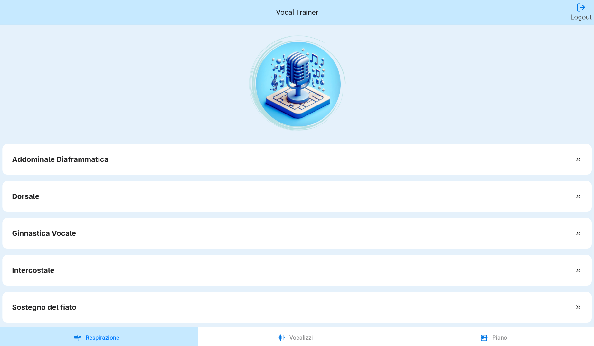

# Vocal Trainer 
 

  

### Welcome to the Vocal Trainer app, a cross-platform vocal training app developed using React Native with Expo.

## Demo
### If you are curious to try it out, you can check the [Web Demo](https://vocaltrainer.netlify.app/)

  
  

## Description

The Vocal Trainer app is a mobile application designed to help singers improve their vocal skills through targeted exercises. The app offers several exercise sections:

- Breathing Exercises
- Vocal Exercises

Each section provides a series of exercises specifically created to develop and improve specific singing skills.

### **Currently, only practice audio suitable for tenor voices is available in the vocal exercises section.**

## Main Features

- Breathing Exercises: This section offers a series of exercises designed to improve breath control and lung capacity for singers.
<!-- 
- Rhythmic Exercises: Here you will find exercises to refine your sense of rhythm and precision in interpreting musical notes. (Still in the planning stage) -->

- Audio Exercises with Vocalizations: The vocal exercises section will allow you to perform a variety of vocalizations to enhance the flexibility and range of your voice.

## Contribution

### Installation

1. Make sure you have [Node.js](https://nodejs.org/) installed. We recommend using [nvm](https://github.com/nvm-sh/nvm) to manage Node.js versions.
2. Clone or download the repository.
3. Open the terminal in the project directory and run `npm install` to install the dependencies.
4. Run `npm start` to start the Expo app.

### System Requirements

- Node.js
- npm
- Expo CLI
- Firebase Storage
- Firebase Realtime Database
- Firebase Authentication

Contributions are welcome! If you wish to contribute to this project, follow these steps:

1. Fork the repository.
2. Create a branch for your changes: `git checkout -b feature/new-feature`.
3. Make your changes and commit: `git commit -m 'Added new feature'`.
4. Push your branch: `git push origin feature/new-feature`.
5. Open a Pull Request in the original repository.

---

Developed by @grnsmn